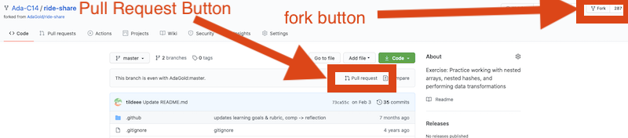
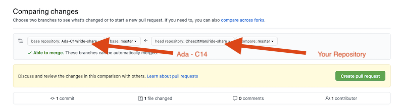

# Ride Share

In this project you will work to organize data into a complex assortment of nested data structures.

<!-- >>>>>>>>>>>>>>>>>>>>>> BEGIN CHALLENGE >>>>>>>>>>>>>>>>>>>>>> -->
<!-- Replace everything in square brackets [] and remove brackets  -->

### !challenge

* type: project
* id: 6b42b1b3-ed09-4793-9584-88535cbce261

##### !question

##### !end-question

##### !placeholder

[text, placeholder text for the input field]

##### !end-placeholder

<!-- other optional sections -->
<!-- !hint - !end-hint (markdown, users can see after a failed attempt) -->
<!-- !rubric - !end-rubric (markdown, instructors can see while scoring a checkpoint) -->
<!-- !explanation - !end-explanation (markdown, students can see after answering correctly) -->

### !end-challenge

<!-- ======================= END CHALLENGE ======================= -->

<!-- >>>>>>>>>>>>>>>>>>>>>> BEGIN CHALLENGE >>>>>>>>>>>>>>>>>>>>>> -->
<!-- Replace everything in square brackets [] and remove brackets  -->

### !challenge

* type: short-answer
* id: 03427a72-f11f-49ed-bfc8-72418643c8b8
* title: Ride Share
* points: 2
* topics: control structures, data structures, hashes, arrays

##### !question

For this assignment, [fork this repository](https://github.com/ada-c14/ride-share) by following the link and clicking on the **fork** button.

Then complete the project by:

1. Reading the `README.md` file
1. Copying the `worksheet.rb` file into your own editor
1. Work through the `worksheet.rb` file tasks answering the questions and writing code to accomplish the given tasks.
1. Paste your solution code into your repository.
1. Click on the **Pull Request** button and create a Pull Request
    
1. Copy the link to your Pull Request (PR) into the textbox below

If you have trouble ask for help on Slack!

##### !end-question

##### !placeholder

Link to your PR here

##### !end-placeholder

##### !answer

/^https:\/\/github\.com\/.*\/pull\/.*\/\d?\d/

##### !end-answer

<!-- other optional sections -->
<!-- !hint - !end-hint (markdown, users can see after a failed attempt) -->
<!-- !rubric - !end-rubric (markdown, instructors can see while scoring a checkpoint) -->
<!-- !explanation - !end-explanation (markdown, students can see after answering correctly) -->

### !end-challenge

<!-- ======================= END CHALLENGE ======================= -->