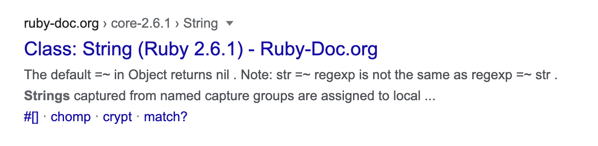
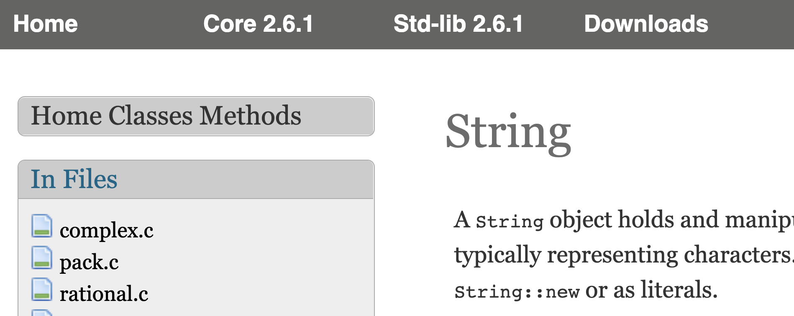
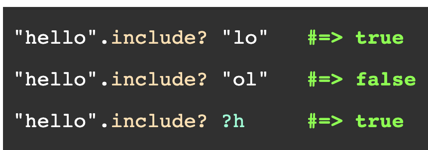
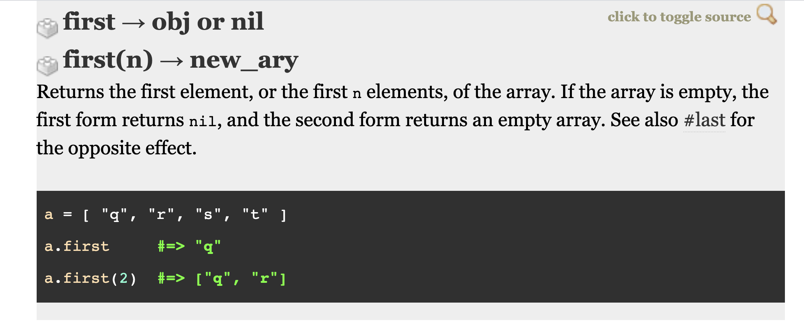
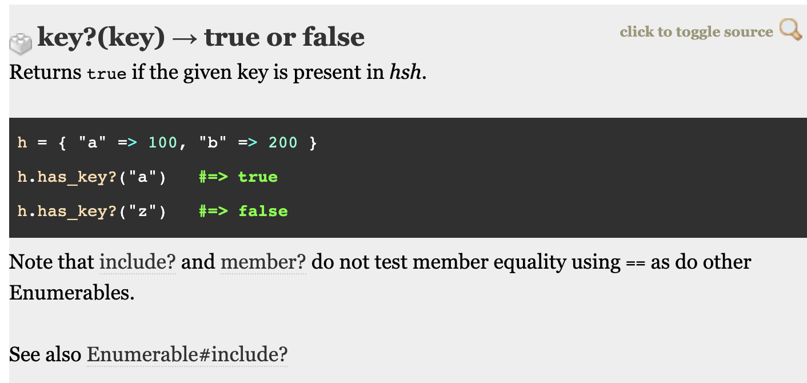

# Built in Methods

The standard Ruby library has a great variety of methods pre-written for common tasks in programming.  Getting familiar with these methods and learning to read the official [Ruby Documentation](https://www.ruby-lang.org/en/documentation/), is an important step toward being a productive developer.  

## Learning Goals

By the end of this lesson, we will be able to...

- Practice reading and interpreting Ruby documentation
- Using `irb` to experiment with unfamiliar Ruby methods

## String Methods

Ruby Strings are objects which hold a sequence of characters.  We use them to read in and output text both to and from the terminal and other sources such as files, the network, etc.  Because they hold a sequence of characters, Strings have some similarities to Arrays.

### Reading Ruby Documentation

Open up a web browser and type, `Ruby String Documentation 2.6` and click search.  You should find an option which goes to **ruby-doc.org** which is the official Ruby documentation.



Click on the link and you will be taken to a page which documents the Ruby String class.  In general you should look for documentation close to your current version of ruby, but in general, any version number close to yours will work.



Scroll down to the Methods section.  You will notice that all the method names are preceeded by a hash or `#` character.  This is because in Ruby standard documentation methods are written as:

```
Class#method
```

This doesn't apply to code, but just lets readers of the documentation quickly identify methods and the classes they go to.  So for all these methods they can be called on Strings.

#### So what is a `Class`?

If you go into irb and type `"some string".class` you will get

```ruby
"some string".class
=> String
```

`String` is the name of a class.  You can think of it as a blueprint for how to make strings.  Similarly there is an `Array` class which is code written to generate different arrays.  Each class has a collection of methods which are actions which can be performed on that type of object.  We will take a look at a variety of methods for Strings, Arrays and Hashes.

#### `#include?` Method

Find the `include?` method in the list of String methods.  You can see the documentation below:


The documentation header `include? other_str → true or false` details the:

1.  Method name `include?`
1.  Parameters if any, `other_str`
1.  Return value `true or false`

Next, the documentation gives a description of the method. This is where you can find out what the **responsibility of the method** is, and its intended purpose.

```txt
Returns true if str contains the given string or character.
```

Then below in the black square the documenation lists some example method calls.



Lastly you can see the source code for the method (written in C).  Unless you are familiar with the sourcecode this is usually less than useful.  

### Experimenting in IRB

Another way to learn a Ruby method is to explore it in irb.  

Open terminal and type `irb` to enter the repl.

Then create some string variables and try calling `include?` with various arguments.

Example run:

```ruby
➜  $ ✗ irb
[1] pry(main)> one_string = "Pasta Mariana"
=> "Pasta Mariana"
[2] pry(main)> other_string = "Linguine"
=> "Linguine"
[3] pry(main)> third_string = "Risotto Pasta"
=> "Risotto Pasta"
[4] pry(main)> one_string.include? "Pasta"
=> true
[5] pry(main)> main_dish = "Pasta"
=> "Pasta"
[6] pry(main)> one_string.include? main_dish
=> true
[7] pry(main)> main.dish.include? third_string
[8] pry(main)> main_dish.include? third_string
=> false
[9] pry(main)> other_string.include? "guin"
=> true
```

### Further Questions on String Methods

Now explore String methods and answer the following questions:

<!-- >>>>>>>>>>>>>>>>>>>>>> BEGIN CHALLENGE >>>>>>>>>>>>>>>>>>>>>> -->
<!-- Replace everything in square brackets [] and remove brackets  -->

### !challenge

* type: multiple-choice
* id: 7b08831e-9c61-452b-8949-69f533fa3699
* title: Calling .include?
* points: 1
* topics: ruby-methods

##### !question

Given the following

```ruby
name = "Lyra Erso"
puts name.include? "Lyra"
```

What should be printed out

##### !end-question

##### !options

* true
* false
* Lyra Erso

##### !end-options

##### !answer

* true

##### !end-answer

<!-- other optional sections -->
##### !hint

`.include` returns true if the string contains the given string, which it does.

##### !end-hint
<!-- !rubric - !end-rubric (markdown, instructors can see while scoring a checkpoint) -->
<!-- !explanation - !end-explanation (markdown, students can see after answering correctly) -->

### !end-challenge

<!-- ======================= END CHALLENGE ======================= -->

<!-- >>>>>>>>>>>>>>>>>>>>>> BEGIN CHALLENGE >>>>>>>>>>>>>>>>>>>>>> -->
<!-- Replace everything in square brackets [] and remove brackets  -->

### !challenge

* type: multiple-choice
* id: 489f6411-1cdb-4dd8-ad2c-d8c92cae9c85
* title: Calling .include?
* points: 1
* topics: ruby-methods

##### !question

Given the following

```ruby
name = "Lyra Erso"
puts name.include? "Lyran"
```

What should be printed out

##### !end-question

##### !options

* true
* false
* Lyra Erso

##### !end-options

##### !answer

* false

##### !end-answer

<!-- other optional sections -->
##### !hint

`.include` returns true if the string contains the given string, which it does **not**.

##### !end-hint
<!-- !rubric - !end-rubric (markdown, instructors can see while scoring a checkpoint) -->
<!-- !explanation - !end-explanation (markdown, students can see after answering correctly) -->

### !end-challenge

<!-- ======================= END CHALLENGE ======================= -->


<!-- >>>>>>>>>>>>>>>>>>>>>> BEGIN CHALLENGE >>>>>>>>>>>>>>>>>>>>>> -->
<!-- Replace everything in square brackets [] and remove brackets  -->

### !challenge

* type: multiple-choice
* id: 3b851466-cdc7-40d3-b89e-adca6b95bdc8
* title: Case sensitive
* points: 1
* topics: ruby-methods

##### !question

By experimenting with irb, is `.include?` case sensitive?  Does it require capitalization to match?

##### !end-question

##### !options

* Yes
* No
* Sometimes

##### !end-options

##### !answer

* Yes

##### !end-answer

<!-- other optional sections -->
<!-- !hint - !end-hint (markdown, users can see after a failed attempt) -->
<!-- !rubric - !end-rubric (markdown, instructors can see while scoring a checkpoint) -->
<!-- !explanation - !end-explanation (markdown, students can see after answering correctly) -->

### !end-challenge

<!-- ======================= END CHALLENGE ======================= -->

<!-- >>>>>>>>>>>>>>>>>>>>>> BEGIN CHALLENGE >>>>>>>>>>>>>>>>>>>>>> -->
<!-- Replace everything in square brackets [] and remove brackets  -->

### !challenge

* type: multiple-choice
* id: a825d2c9-f38e-456b-946c-4c090efe9128
* title: Other data types
* points: 1
* topics: ruby-methods

##### !question

By experimenting with irb, does `.include?` work with non-strings passed as arguments?  Could you call `.include?` with an integer parameter?

##### !end-question

##### !options

* Yes, it works by converting the argument to a string
* No, it always returns false
* It results in an error

##### !end-options

##### !answer

* It results in an error

##### !end-answer

<!-- other optional sections -->
##### !hint

if you put `"314".include? 3` into irb you will recieve a `TypeError`.

##### !end-hint
<!-- !rubric - !end-rubric (markdown, instructors can see while scoring a checkpoint) -->
<!-- !explanation - !end-explanation (markdown, students can see after answering correctly) -->

### !end-challenge

<!-- ======================= END CHALLENGE ======================= -->

### More String methods

Using the documentation and irb answer the following questions about:

*  `upcase`
*  `downcase`
*  `swapcase`

<!-- >>>>>>>>>>>>>>>>>>>>>> BEGIN CHALLENGE >>>>>>>>>>>>>>>>>>>>>> -->
<!-- Replace everything in square brackets [] and remove brackets  -->

### !challenge

* type: multiple-choice
* id: 71fab322-47df-4c76-89f5-9558aea95476
* title: Upcase
<!-- * points: [1] (optional, the number of points for scoring as a checkpoint) -->
* topics: ruby-methods
  
##### !question

What would `"pasta".upcase` return?

##### !end-question

##### !options

* "pasta"
* "PASTA"
* "Pasta"
* "Spaghetti"

##### !end-options

##### !answer

* "PASTA"

##### !end-answer

<!-- other optional sections -->
<!-- !hint - !end-hint (markdown, users can see after a failed attempt) -->
<!-- !rubric - !end-rubric (markdown, instructors can see while scoring a checkpoint) -->
<!-- !explanation - !end-explanation (markdown, students can see after answering correctly) -->

### !end-challenge

<!-- ======================= END CHALLENGE ======================= -->

<!-- >>>>>>>>>>>>>>>>>>>>>> BEGIN CHALLENGE >>>>>>>>>>>>>>>>>>>>>> -->
<!-- Replace everything in square brackets [] and remove brackets  -->

### !challenge

* type: multiple-choice
* id: 79bcb1e0-7fd2-4f6e-bce2-6cd10370e338
* title: Downcase question
<!-- * points: [1] (optional, the number of points for scoring as a checkpoint) -->
* topics: ruby-methods

##### !question

What would "123".downcase return?

##### !end-question

##### !options

* "123"
* "!@#"
* "one hundred and twenty three"

##### !end-options

##### !answer

* "123"

##### !end-answer

<!-- other optional sections -->
<!-- !hint - !end-hint (markdown, users can see after a failed attempt) -->
<!-- !rubric - !end-rubric (markdown, instructors can see while scoring a checkpoint) -->
<!-- !explanation - !end-explanation (markdown, students can see after answering correctly) -->

### !end-challenge

<!-- ======================= END CHALLENGE ======================= -->

<!-- >>>>>>>>>>>>>>>>>>>>>> BEGIN CHALLENGE >>>>>>>>>>>>>>>>>>>>>> -->
<!-- Replace everything in square brackets [] and remove brackets  -->

### !challenge

* type: multiple-choice
* id: 482b5465-45de-45fe-b9df-a7fe1e09909f
* title: Swapcase
<!-- * points: [1] (optional, the number of points for scoring as a checkpoint) -->
* topics: ruby-methods

##### !question

What would "Pasta".swapcase return?

##### !end-question

##### !options

* "Pasta"
* "pASTA"
* "pasta"
* "PASTA"

##### !end-options

##### !answer

* "pASTA"

##### !end-answer

<!-- other optional sections -->
<!-- !hint - !end-hint (markdown, users can see after a failed attempt) -->
<!-- !rubric - !end-rubric (markdown, instructors can see while scoring a checkpoint) -->
<!-- !explanation - !end-explanation (markdown, students can see after answering correctly) -->

### !end-challenge

<!-- ======================= END CHALLENGE ======================= -->

## Array Methods

Similarly to the String class Ruby's Array class also has a large number of useful methods.  We will examine the `Array#first` method and then allow you to explore other methods.

Search for the `Ruby Array class` and pull up it's documentation page.

Then if we look at the `Array#first` method we see the following:



The first two lines illustrate different method signatures.  One allows you to call the method with no arguments and the second signature has a parameter `n`.

```
first → obj or nil
first(n) → new_ary
```

*  So if you call the method with no arguments it returns either an object `obj` or `nil`.  
*  On the other hand if you call the method with an argument, `n`, it will return the first `n` elements as a new Array.  You can also see several examples of using `#first`.  

### Activity Researching Methods

Using the documentation and experimenting with irb answer the following:

<!-- >>>>>>>>>>>>>>>>>>>>>> BEGIN CHALLENGE >>>>>>>>>>>>>>>>>>>>>> -->
<!-- Replace everything in square brackets [] and remove brackets  -->

### !challenge

* type: multiple-choice
* id: 25659768-b74b-4e18-b827-c9cda6236eea
* title: Ruby `first` method
<!-- * points: [1] (optional, the number of points for scoring as a checkpoint) -->
* topics: ruby-methods

##### !question

What will the following return?

```ruby
list = [1, 2, 3, 4, 5]
list.first(3)
```

##### !end-question

##### !options

* `1`
* `[1, 2, 3, 4, 5]`
* `[1, 2, 3]`

##### !end-options

##### !answer

* `[1, 2, 3]`

##### !end-answer

<!-- other optional sections -->
##### !hint

If you give an argument `n` to `first` it will return a new list of `n` elements.

##### !end-hint
<!-- !rubric - !end-rubric (markdown, instructors can see while scoring a checkpoint) -->
<!-- !explanation - !end-explanation (markdown, students can see after answering correctly) -->

### !end-challenge

<!-- ======================= END CHALLENGE ======================= -->

<!-- >>>>>>>>>>>>>>>>>>>>>> BEGIN CHALLENGE >>>>>>>>>>>>>>>>>>>>>> -->
<!-- Replace everything in square brackets [] and remove brackets  -->

### !challenge

* type: multiple-choice
* id: 1fa55bf4-cab1-4efa-a76b-f14c9924b5eb
* title: last
<!-- * points: [1] (optional, the number of points for scoring as a checkpoint) -->
* topics: ruby-methods

##### !question

Look up the `Array#last` method.  What will the following return:

```ruby
list = [1, 2, 3, 4, 5]
list.last(3)
```

##### !end-question

##### !options

* `[1, 2, 3]`
* `3`
* `[3, 4, 5]`

##### !end-options

##### !answer

* `[3, 4, 5]`

##### !end-answer

<!-- other optional sections -->
##### !hint

If last recieves an argument, `n`, it will return the last `n` elements as a new array.

##### !end-hint
<!-- !rubric - !end-rubric (markdown, instructors can see while scoring a checkpoint) -->
<!-- !explanation - !end-explanation (markdown, students can see after answering correctly) -->

### !end-challenge

<!-- ======================= END CHALLENGE ======================= -->

<!-- >>>>>>>>>>>>>>>>>>>>>> BEGIN CHALLENGE >>>>>>>>>>>>>>>>>>>>>> -->
<!-- Replace everything in square brackets [] and remove brackets  -->

### !challenge

* type: multiple-choice
* id: ac7b287c-67ac-4e8e-a803-ca40ca5fb592
* title: Rotate Question
<!-- * points: [1] (optional, the number of points for scoring as a checkpoint) -->
* topics: ruby-methods

##### !question

Look up the `Array#rotate` method.  What will the following return:

```ruby
list = [1, 2, 3, 4, 5]
list.rotate(3)
```

##### !end-question

##### !options

* [3, 4, 5, 1, 2]
* [5, 1, 2, 3, 4]
* [4, 5, 1, 2, 3]
* [1, 2, 3, 4, 5]

##### !end-options

##### !answer

* [4, 5, 1, 2, 3]

##### !end-answer

<!-- other optional sections -->
##### !hint

Rotate one-by-one takes the first element from an Array and puts it on the rear.  It repeats the process `n` times.

##### !end-hint
<!-- !rubric - !end-rubric (markdown, instructors can see while scoring a checkpoint) -->
<!-- !explanation - !end-explanation (markdown, students can see after answering correctly) -->

### !end-challenge

<!-- ======================= END CHALLENGE ======================= -->

<!-- >>>>>>>>>>>>>>>>>>>>>> BEGIN CHALLENGE >>>>>>>>>>>>>>>>>>>>>> -->
<!-- Replace everything in square brackets [] and remove brackets  -->

### !challenge

* type: multiple-choice
* id: 9a8c43b3-f2ef-400d-9fc5-dbe3a730adf8
* title: Array#clear method
<!-- * points: [1] (optional, the number of points for scoring as a checkpoint) -->
* topics: ruby-methods

##### !question

Look up the `Array#clear` method.  What will the following return:

```ruby
list = [1, 2, 3, 4, 5]
list.clear
```

##### !end-question

##### !options

* `[]`
* `[1, 2, 3, 4, 5]`
* `nil`

##### !end-options

##### !answer

* `[]`

##### !end-answer

<!-- other optional sections -->
##### !hint

`Array#clear` empties the array

##### !end-hint
<!-- !rubric - !end-rubric (markdown, instructors can see while scoring a checkpoint) -->
<!-- !explanation - !end-explanation (markdown, students can see after answering correctly) -->

### !end-challenge

<!-- ======================= END CHALLENGE ======================= -->

<!-- >>>>>>>>>>>>>>>>>>>>>> BEGIN CHALLENGE >>>>>>>>>>>>>>>>>>>>>> -->
<!-- Replace everything in square brackets [] and remove brackets  -->

### !challenge

* type: multiple-choice
* id: bf9be159-186d-4194-92e8-82bdcf9211d4
* title: [text, a short question title]
<!-- * points: [1] (optional, the number of points for scoring as a checkpoint) -->
* topics: ruby-methods

##### !question

Look up the `Array#clear` and `Array#empty?` methods.  What will the following return:

```ruby
list = [1, 2, 3, 4, 5]
list.clear
list.empty?
```

##### !end-question

##### !options

* `[]`
* `[1, 2, 3, 4, 5]`
* `nil`
* true
* false

##### !end-options

##### !answer

* true

##### !end-answer

<!-- other optional sections -->
##### !hint

`list.clear` will remove everything from the array, making it `[]` and then `list.empty?` will return **true** because the list is empty.

##### !end-hint
<!-- !rubric - !end-rubric (markdown, instructors can see while scoring a checkpoint) -->
<!-- !explanation - !end-explanation (markdown, students can see after answering correctly) -->

### !end-challenge

<!-- ======================= END CHALLENGE ======================= -->

## Hash Methods

Like the Array class, Ruby's Hash class also has a variety of useful methods.  

We will examine the `Hash#key?` method and then allow you to explore other methods.

Search for the `Ruby Hash class` and pull up it's documentation page.

Then if we look at the `Hash#key?` method we see the following:



The first line tells you that it takes one parameter, `key` and returns true or false.  The description tells you that: `Returns true if the given key is present in hsh.`

### Activity Researching Methods

Using the documentation and experimenting with irb, answer the following Hash methods:

* `Hash#keys`
* `Hash#values`
* `Hash#value?`
* `Hash#invert`

Then answer the following questions.

<!-- >>>>>>>>>>>>>>>>>>>>>> BEGIN CHALLENGE >>>>>>>>>>>>>>>>>>>>>> -->
<!-- Replace everything in square brackets [] and remove brackets  -->

### !challenge

* type: multiple-choice
* id: 19d70dbc-c4ca-4224-bfec-e271e96afeda
* title: Question on `Hash#keys` method
<!-- * points: [1] (optional, the number of points for scoring as a checkpoint) -->
* topics: ruby-methods

##### !question

Look up the `Hash#keys` method.  What will the following return:

```ruby
student = {
  name: "Ada Lovelace",
  id: 12345,
  email: "ada@lovelace.com",
}

student.keys
```

##### !end-question

##### !options

* [:name, :id, :email]
* ["Ada Lovelace", 12345, "ada@lovelace.com"]
* true
* false

##### !end-options

##### !answer

* [:name, :id, :email]

##### !end-answer

<!-- other optional sections -->
##### !hint

The `keys` method takes all the keys from the key-value pairs and returns them in an array.

##### !end-hint
<!-- !rubric - !end-rubric (markdown, instructors can see while scoring a checkpoint) -->
<!-- !explanation - !end-explanation (markdown, students can see after answering correctly) -->

### !end-challenge

<!-- ======================= END CHALLENGE ======================= -->

<!-- >>>>>>>>>>>>>>>>>>>>>> BEGIN CHALLENGE >>>>>>>>>>>>>>>>>>>>>> -->
<!-- Replace everything in square brackets [] and remove brackets  -->

### !challenge

* type: multiple-choice
* id: 7df47a76-fc7b-4afb-92a7-24b60d9e7115
* title: Question on `Hash#values`
<!-- * points: [1] (optional, the number of points for scoring as a checkpoint) -->
* topics: ruby-methods

##### !question


Look up the `Hash#values` method.  What will the following return:

```ruby
student = {
  name: "Ada Lovelace",
  id: 12345,
  email: "ada@lovelace.com",
}

student.values
```

##### !end-question

##### !options

* [:name, :id, :email]
* ["Ada Lovelace", 12345, "ada@lovelace.com"]
* true
* false

##### !end-options

##### !answer

* ["Ada Lovelace", 12345, "ada@lovelace.com"]

##### !end-answer

<!-- other optional sections -->
##### !hint

The `values` method takes all the values from the key-value pairs and returns them in an array.

##### !end-hint
<!-- !rubric - !end-rubric (markdown, instructors can see while scoring a checkpoint) -->
<!-- !explanation - !end-explanation (markdown, students can see after answering correctly) -->

### !end-challenge

<!-- ======================= END CHALLENGE ======================= -->

<!-- >>>>>>>>>>>>>>>>>>>>>> BEGIN CHALLENGE >>>>>>>>>>>>>>>>>>>>>> -->
<!-- Replace everything in square brackets [] and remove brackets  -->

### !challenge

* type: multiple-choice
* id: 4f6b3aac-69af-45ac-a723-7f4e539ec455
* title: Question on `Hash#invert`
<!-- * points: [1] (optional, the number of points for scoring as a checkpoint) -->
* topics: ruby-methods

##### !question

Look up the `Hash#invert` method.  What will the following return:

```ruby
student = {
  name: "Ada Lovelace",
  id: 12345,
  email: "ada@lovelace.com",
  secondary_email: "ada@lovelace.com",
}

student.invert
```

##### !end-question

##### !options

* `{ :name => "Ada Lovelace", :id => 12345, :email => "ada@lovelace.com", :secondary_email => "ada@lovelace.com"}`
* `{:name=>"Ada Lovelace", :id=>12345, :email=>"ada@lovelace.com"}`
* `{:name=>"Ada Lovelace", :id=>12345, :email=>"ada@lovelace.com", :secondary_email=>"ada@lovelace.com"}`
* `{"Ada Lovelace"=>:name, 12345=>:id, "ada@lovelace.com"=>:secondary_email}`

##### !end-options

##### !answer

* `{"Ada Lovelace"=>:name, 12345=>:id, "ada@lovelace.com"=>:secondary_email}`

##### !end-answer

<!-- other optional sections -->
##### !hint

The `Hash#invert` method reverses they key-value pairs.  The problem is that keys must be unique, so if two values are identical, then only the 2nd one appears in the inverted hash.

##### !end-hint
<!-- !rubric - !end-rubric (markdown, instructors can see while scoring a checkpoint) -->
<!-- !explanation - !end-explanation (markdown, students can see after answering correctly) -->

### !end-challenge

<!-- ======================= END CHALLENGE ======================= -->

## Conclusion

When we recognize that we're using an unfamiliar Ruby method, one of our first instincts should be to use the Internet, Ruby docs, and `irb` to figure out the following things:

1. Its primary responsibility (what it's supposed to do)
1.  Method name
1.  Parameters if any
1.  Return value

If we combine documentation, experimentation, examples, and practice, we'll be able to understand methods much more quickly.
## Resources

- [Ruby Documentation](https://www.ruby-lang.org/en/documentation/)
- [Reading Ruby Methods in Documentation](https://medium.com/@patrick.s.santucci/reading-ruby-methods-in-documentation-91b615dd92ba)
