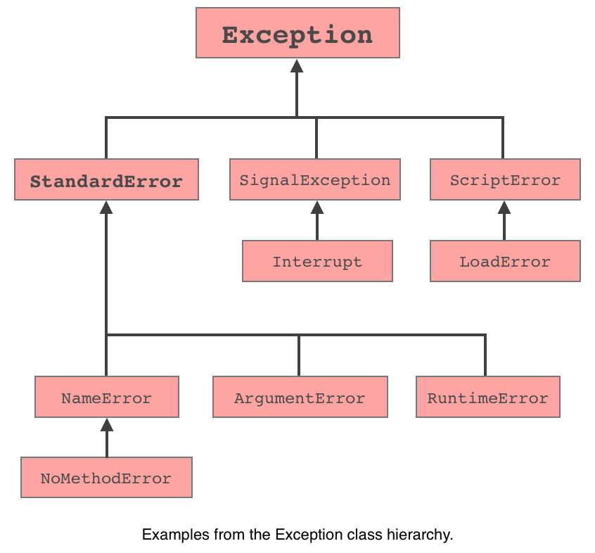

# Exception Handling In Ruby

## Learning Goals

At the end of this we should be able to...

- Explain how exception handling works
- Create `begin-rescue` blocks to "catch" exceptions
- Evaluate when to use exceptions

## The Story So Far

With any program there are things that can go wrong. Maybe a file you are planning to read doesn't exist, your database server is unavailable, or you try to divide something by zero. In these cases, Ruby programs use _exceptions_ to indicate that something has gone wrong.

We've seen exceptions before. If you try to access an undefined variable, Ruby will raise a `NameError`, if you use a method that doesn't exist, you'll get a `NoMethodError` and we've also seen `ArgumentError` exceptions in our projects.

## What Are Exceptions?

`ArgumentError` is a type of error, and the thing that we're raising is an _instance_ of `ArgumentError`. There's a whole bunch of built-in Ruby magic around the `raise` keyword, but the exceptions themselves are just objects like any other such as Strings, binding together data and behavior.

The most generic kind of exception is `Exception`, which basically says something went wrong.  All more specialized exceptions are children of the `Exception` class, inheriting its core functionality.  All that means is they have all the abilities of a general exception and they could add additional features.

Really all you need to know is the subtypes of `Exception` indicate different _kinds_ of errors, the further down the heirchy below the more specific the exception is.



The Ruby docs have a [full list of built in Ruby exceptions](https://ruby-doc.org/core/Exception.html).


### Producing Exceptions

For a quick reminder of what another exception looks like, save the following code as `divide_by_zero.rb`

```ruby
# divide_by_zero.rb
quotient = 5 / 0
puts quotient # this code will never run
```

and run it from the command line

```
$ ruby divide_by_zero.rb
divide_by_zero.rb:2:in `/': divided by 0 (ZeroDivisionError)
  from divide_by_zero.rb:2:in `<main>'
```

If you need to produce an exception of your own you can use the `raise` keyword

```ruby
def make_toast(slices)
  if slices < 1
    raise ArgumentError.new("Can't make less than 1 slice of toast (asked for #{slices})")
  end
end
```

## Handling Exceptions

So far, when a program has produced and exception, it has immediately terminated. However, there's often something more productive to be done. For example, if you ask the user for a file name and then get an exception because it doesn't exist, it's much more polite to let them know with `puts` than to dump a scary stack trace to the terminal.

Fortunately, Ruby gives us a way to stop an exception before it bubbles up to the user: a `begin/rescue` block. Let's see it in action:

```ruby
# sample_exception.rb
begin
  # Dividing by zero causes an error
  quotient = 5 / 0
  puts "Made it past the error"
rescue
  quotient = nil
  puts "Rescued the error and set quotient to nil"
end
```

The output would be:
```
$  ruby sample_exception.rb
Rescued the error and set quotient to nil
```

Note that without the rescue clause, the exception still bubbles up to the user.

```ruby
# sample_exception.rb
begin
  # Dividing by zero causes an error
  quotient = 5 / 0
  puts "Made it past the error"
end
```

The output would be:
```
$  ruby sample_exception.rb
sample_exception.rb:4:in `/': divided by 0 (ZeroDivisionError)
  from sample_exception.rb:4:in `<main>'
```

<!-- available callout types: info, success, warning, danger, secondary  -->
### !callout-info

## Vocabulary note

In many languages, `raise` and `rescue` are called `throw` and `catch`, and you will often hear people talking about "throwing" or "catching" an exception.

### !end-callout

### Rescuing Specific Exceptions

Ruby provides many different types of exceptions, and a `rescue` block will capture any of them. However, this has some drawbacks:
- What if you need to handle different exceptions in different ways?
- What if you were expecting a `ZeroDivisionError`, but instead got a `NameError` from an undefined variable due to a programming error?

Fortunately, Ruby allows you to specify which type of exception you want to rescue. The syntax looks like this:

```ruby
begin
  # some code that will create an exception.

rescue ArgumentError
  # Code to recover from an ArgumentError

rescue ZeroDivisionError
  # Code to recover from a ZeroDivisionError

rescue
  # any other exceptions handled here

end
```

If you specify a type of exception, Ruby will rescue that exception as well as any of its subclasses. That means that `rescue Exception` will rescue all exceptions, since all exceptions are subclasses of `Exception` (and is therefore not a very useful approach).

Most recoverable errors inherit from `StandardError`, and without any arguments `rescue` will only rescue `StandardError` and its subclasses.

It is almost always worth your time to figure out exactly what type of exception you're expecting, and rescue **only that**. Otherwise you're setting yourself up to ignore the valuable information Ruby is giving you about why your program failed. A bare `rescue` with no exception type specified is a classic example of sloppy programming.

### Accessing a Rescued Exception

Exceptions are full of useful information about what went wrong, which is often useful inside a `rescue` clause. Ruby allows us to access the thrown exception using `=>`

```ruby
begin
  # do something risky
rescue ArgumentError => exception
  puts "Encountered an error: #{exception}"
end
```

Like method or block parameters, the rescued exception is a local variable and may be called anything you please.

### Exercise

Setup:
1. Create a new file called `csv_printer.rb` in your working directory.
1. Copy the following code into that file.
1. Review what the code is doing with another student, if you can, or explain the code to a "rubber duck," if you cannot.
1. Run the code a few times to exercise each code branch.

```ruby
# csv_printer.rb
require 'csv'

while true
  puts "What file would you like to print?"
  filename = gets.chomp

  begin
    CSV.read(filename).each do |line|
      puts line.join(",")
    end

  rescue SystemCallError => exception
    puts "Could not open file: #{exception.message}"
  end

  puts "Would you like to go again?"
  break if gets.chomp != "yes"
end
```


**Comprehension Questions:**

Answer the comprehension prior to changing and executing the code to test your understanding.

<!-- >>>>>>>>>>>>>>>>>>>>>> BEGIN CHALLENGE >>>>>>>>>>>>>>>>>>>>>> -->
<!-- Replace everything in square brackets [] and remove brackets  -->

### !challenge

* type: short-answer
* id: 66ef1688-2864-4d46-9bb6-4694d634f0fb
* title: What happens if you remove the `=> exception` code?
* points: 1
* topics: exceptions

##### !question

What happens if you remove the `=> exception` code?

##### !end-question

##### !placeholder

What happens?

##### !end-placeholder

##### !answer

/error|exception/i

##### !end-answer

<!-- other optional sections -->
<!-- !hint - !end-hint (markdown, users can see after a failed attempt) -->
<!-- !rubric - !end-rubric (markdown, instructors can see while scoring a checkpoint) -->
##### !explanation

You get an error which reads:  `undefined local variable or method 'exception' for main:Object (NameError)` which occurs because the variable in the rescue block is now unknown.

##### !end-explanation

### !end-challenge

<!-- ======================= END CHALLENGE ======================= -->

<!-- >>>>>>>>>>>>>>>>>>>>>> BEGIN CHALLENGE >>>>>>>>>>>>>>>>>>>>>> -->
<!-- Replace everything in square brackets [] and remove brackets  -->

### !challenge

* type: short-answer
* id: f4b176ed-cac3-4c77-9f93-9fcd08658023
* title: Changing the local variable name
* points: 1
* topics: exceptions

##### !question

What happens if you change the `=> exception` code to `=> my_exception`, changing all occurance of `exception` and replacing it with `my_exception`.

##### !end-question

##### !placeholder

What happens?

##### !end-placeholder

##### !answer

/.+/

##### !end-answer

<!-- other optional sections -->
<!-- !hint - !end-hint (markdown, users can see after a failed attempt) -->
<!-- !rubric - !end-rubric (markdown, instructors can see while scoring a checkpoint) -->
##### !explanation

It works because `exception` is a local variable and you get to choose the name.

##### !end-explanation

### !end-challenge

<!-- ======================= END CHALLENGE ======================= -->


<!-- >>>>>>>>>>>>>>>>>>>>>> BEGIN CHALLENGE >>>>>>>>>>>>>>>>>>>>>> -->
<!-- Replace everything in square brackets [] and remove brackets  -->

### !challenge

* type: short-answer
* id: 3a4b226a-16ac-43e5-adfb-7fdfad33d956
* title: Modified Rescue
* points: 1
* topics: exceptions

##### !question

What happens if the `rescue` block is modified to look like the code below?
```ruby
...
rescue SystemCallError => exception
  puts "Could not open file: #{exception.message}"

  puts "Would you like to go again?"
  break if gets.chomp != "yes"
end
```

##### !end-question

##### !placeholder

What happens if you modify the block as above?

##### !end-placeholder

##### !answer

/.+/

##### !end-answer

<!-- other optional sections -->
<!-- !hint - !end-hint (markdown, users can see after a failed attempt) -->
<!-- !rubric - !end-rubric (markdown, instructors can see while scoring a checkpoint) -->
##### !explanation

It works, but you can't exit the loop until the file can't be read.  The is because the `break` is inside the rescue block.

##### !end-explanation

### !end-challenge

<!-- ======================= END CHALLENGE ======================= -->

### In Minitest

If we expect a method to raise an exception and it doesn't, that's a bug! This means that we must test that our methods raise the exceptions we want, as well as testing nominal behavior. As we saw on in several projects, you can look for an exception in a given block of code in Minitest like this

```ruby
it "Raises an ArgumentError when given an invalid word" do
  expect {
    Scrabble::Scoring.score("1337")
  }.must_raise ArgumentError
end
```

## When to Use Exceptions

Exceptions aren't the only way to indicate that something has gone wrong. For example, a common pattern is to return `nil` if a searched element isn't found.

```ruby
class SolarSystem
  def lookup_by_name(name)
    planets.each do |planet|
      return planet if planet.name == name
    end
    return nil
  end
end
```

So when are exceptions appropriate? There are a lot of [differing opinions](https://www.sitepoint.com/ruby-error-handling-beyond-basics/), but the consensus seems to be that exception handling should be for *exceptional* circumstances.

Here are some examples of when and when not to raise an exception. Each of the following situations is paired with an example in the context of `Adagrams`.

<!-- available callout types: info, success, warning, danger, secondary  -->
### !callout-info

## Raise an Exception When

- A method is given invalid arguments
  - A string with non-letters
- Some required resource can't be found or is invalid
  - A file with english words `dictionary.csv` doesn't exist
- There's a problem external to Ruby
  - User pressed `Ctrl-C`

### !end-callout

Note that many of these are handled automatically by Ruby!

<!-- available callout types: info, success, warning, danger, secondary  -->
### !callout-danger

## Don't Raise an Exception When

- The method is called with an empty array
  - return `nil` for `highest_scoring_word` when given an empty list
- Two words are tied for the highest scoring word

### !end-callout

In general, an exception indicates that either there was a programming error, or the user has done something wrong. In other words, some human intervention is required. If the program can handle a situation automatically, an exception is probably not the right choice.

## Vocabulary

| Term        | Meaning                                                                                                                                                |
| ----------- | ------------------------------------------------------------------------------------------------------------------------------------------------------ |
| Exception   | An object describing something that went wrong with a program. If not handled, will cause the program to terminate.                                    |
| Stack Trace | The stuff Ruby dumps to the screen when it hits an unhandled exception. Describes exactly what the program was doing when the exception occurred.      |
| `raise`     | Ruby keyword used to cause an exception to take effect. Often used as a verb.                                                                          |
| `begin`     | Ruby keyword used to mark the beginning of a block of code that might produce an exception.                                                            |
| `rescue`    | Ruby keyword used to specify code to execute if an exception happens. Attached to a `begin` block.                                                     |
| `ensure`    | Ruby keyword used to specify code that must execute, even if there's an unhandled exception. Attached to a `begin` block. Not covered in this lecture. |
| Throw       | Synonym for raise                                                                                                                                      |
| Catch       | Synonym for rescue                                                                                                                                     |
| Finally     | Synonym for ensure                                                                                                                                     |

## What Have We Accomplished?

- Reviewed raising exceptions
- Analyzed a stack trace produced by an exception
- Discussed the exception class hierarchy
- Used `rescue` to handle exceptions
- `rescue <ExceptionType>` to handle a specific type of exception
- `rescue <ExceptionType> => exception` to store the exception in a local variable
- Discussed when to use exceptions

## Additional Resources

- [RubyLearning on Exceptions](http://rubylearning.com/satishtalim/ruby_exceptions.html)
- [Ruby Error Handling Beyond the Basics](https://www.sitepoint.com/ruby-error-handling-beyond-basics/)
- [Railscast Exception Handling, old but still valid](http://railscasts.com/episodes/53-handling-exceptions?autoplay=true)