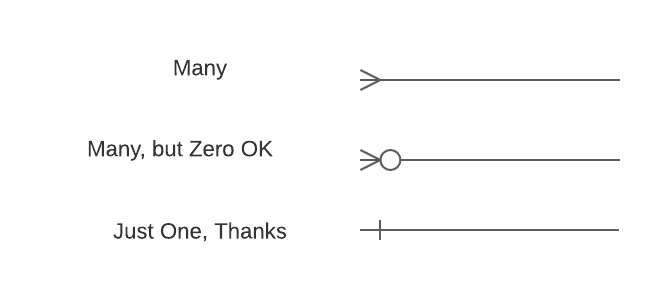
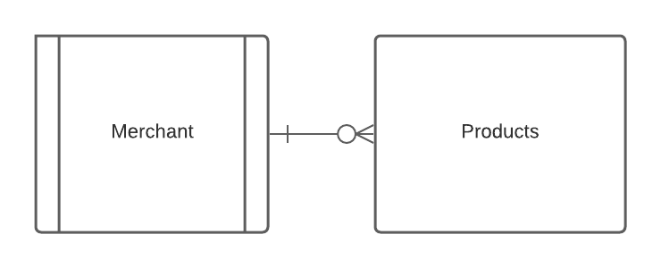
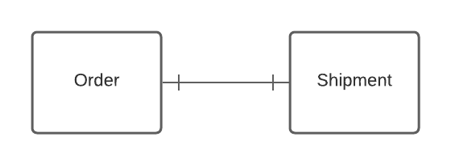
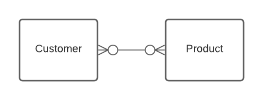
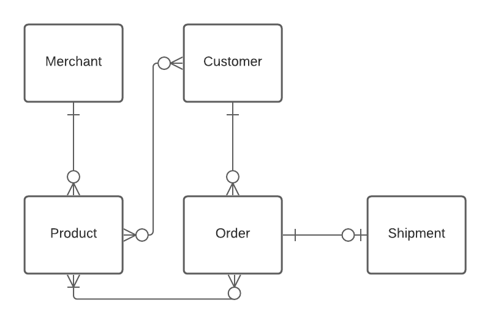

# Object Composition

## Learning Goals
By the end of this lesson, students should be able to...
- Define _object composition_
- Compare and contrast three different types of composition relations
  - One-to-many
  - One-to-one
  - Many-to-many
- Create simple diagrams using Entity Relationship Diagrams

## Object Composition

When building even a moderate sized program, it is unusual for objects to exist in a vacuum. Instead, objects tend to work together, each responsible for a single piece of a larger problem.

For example, in the Solar System project we have two classes that work together. `Planet` is responsible for keeping track of the details of a single planet, and `SolarSystem` is responsible for keeping track of a collection of `Planet`s. By identifying and isolating these two responsibilities, we can build a complex system while keeping the individual pieces relatively simple.

<!-- https://www.lucidchart.com/documents/edit/68ea4ccf-406d-4926-a911-c00404bce113/0 -->

If we were to describe this relationship in English, we would use the term _has a_: "a solar system _has a_ collection of planets". In programming, we call the creation of these _has a_ relationships **object composition**.

Today, we'll be discussing three different types of composition relationships:
- One-to-many
- One-to-one
- Many-to-many

In order to help us understand and communicate the relationships between different classes, we will create Entity Relationship diagrams or ERD's. In and ERD, we use boxes to represent classes, and lines to represent how they are connected. Each line connecting two classes will have special markings to indicate whether there are one or many of them in the relationship. 

How these lines get used to represent these relationships will be clearer as we discuss the relationships themselves, so let's dive in!

## One-to-many

One-to-many is one of the most common relations between different classes. In a one-to-many relationship, one instance of one class is related to many instances of another class.

We've already seen this relation in the Solar System project, where one `SolarSystem` had many `Planet`s. Here are a few other examples:

- In a gradebook application, one class might have many students and many assignments
- On a social media platform, one user might have many posts, and one post might have many comments

<!-- https://www.lucidchart.com/documents/edit/17f87306-242b-4082-b065-a027c2654d09/0 -->

Using the product-merchant example above, interesting questions you might ask about a one-to-many relation include:
- Who sells this product?
- How many products does this merchant offer?
- What is the average price of a product sold by this merchant?

One thing to pay attention to: many may mean zero or one! For example, a new merchant might not have listed any products yet.

If we were to represent the above diagram using ERD, it would look like this:

The side with the merchant has a single hatch across the line to indicate that there is a maximum of one merchant. The products side has a crow's foot and an "O" to tell you to expect many products, but that in some cases it is valid to have none.

## One-to-one

One-to-one relations are a little less common than one-to-many, but no less important. Their main use is to split something that could be one big class into two smaller but related classes.

Here are some examples of one-to-one relations:

- On an e-commerce site, each order has one shipment (destination address, tracking number, etc)
- In a gradebook application, each student has one final grade
- On a social media platform, each user has one profile picture

Again using the e-commerce site, here are some questions you might ask of a one-to-one relationship:
- Where should we ship this order?
- What order is this tracking number for?

<!-- https://www.lucidchart.com/documents/edit/5f2b8739-8626-4283-8c2a-e0b76390b73b/0 -->

A common use for one-to-one relations is when one of the sides is optional. For example, an order on an e-commerce site might not get shipping information until the user has finished paying.

When we go to draw these relationships in ERD, we use a single hatch mark on each side to denote that there is a maximum of one on either side. It looks like this:

## Many-to-many

Many-to-many are a little more complex than the one-to-one or one-to-many, but they still come up quite often.

Here are some examples of many-to-many relationships:
- On an e-commerce site, each customer has many products in their order history, and each product has been ordered by many customers
- In a gradebook, each assignment has been completed by many students, and each student has submitted many assignments
- On a social media platform, every user has many friends (who are also users)

<!-- https://www.lucidchart.com/documents/edit/1e5d44b3-ee2a-4495-a4fe-f94f205aa5b7/0 -->

Remember that "many" may mean zero or one.

Again using the e-commerce example, here are some questions you might ask of a many-to-many relation:
- Which customers have ordered this product?
- How much has this customer spent on the site?
- Which customers have a similar order history to this particular customer? Of those customers, what is the most frequently ordered product that this customer has not yet purchased?

By now, you might be able to guess that our ERD will use crow's feet on both sides to indicate that this relationship is many-to-many!

Many-to-many relations are complex enough that we won't use them in a project until we have the powerful tools provided by Ruby on Rails. However, it's good to practice noticing them when you're using software in your daily life.

## Bringing It All Together

These relationships are often going to exist in conjunction with each other, giving us a series of avenues to walk down from any given class that can tell us a little bit of info about the other data it's related to. When it all comes together, our e-commerce site's current classes might look something like this:

## Exercise

Imagine that we are building a piece of software for a company that publishes books. This software needs to keep track of the following information:

- Authors published by this company, including information like full name, birth date, and a short bio
- Information about the contract for each author, including who their editor is, how many books we've agreed to publish and what percentage of the sales they receive
- All the books published by this company, including title, author and ISBN
- All the bookstores that buy books published by this company, and what books they currently have on order

Work with your neighbors to answer the following questions:

- What classes might this application need?
  - What responsibility does each class have?
- How are the classes related? What types of composition do you see?
  - Draw a picture!

<!-- ## Resources

- [Learn Ruby the Hard Way - Composition](https://learnrubythehardway.org/book/ex44.html#composition)
- [Ruby : Composition over Inheritance because The Force is Strong with Composition](https://medium.com/aviabird/ruby-composition-over-inheritance-3ff786ad9e5d)
- [Refactoring From Inheritance To Composition To Data](https://www.rubypigeon.com/posts/refactoring-inheritance-composition-data/) -->
