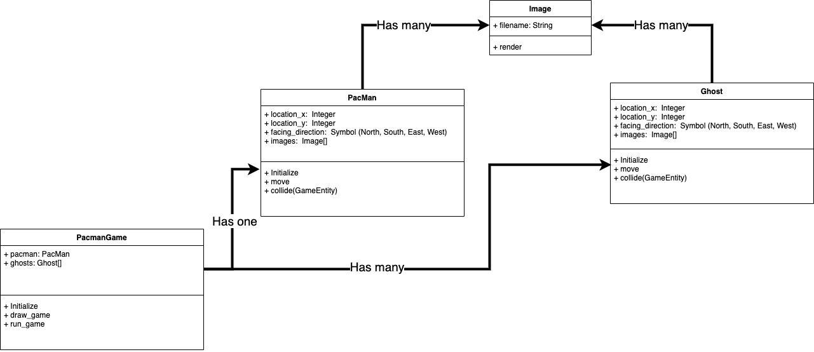

# Object Oriented Design Practice

The purpose of this exercise is to give you practice designing objects and the way they would interact. The goal is _not_ to write the code to complete the exercise, though you're welcome to if you would like. There aren't right or wrong answers, specifically, but _decisions_ you can make to structure your code.

We will take our designs to a Roundtable and talk through the scenario as a group.

## Problem Statement

We need to design a system that would allow us to utilize a deck of cards in a [BlackJack game](https://www.youtube.com/watch?v=qd5oc9hLrXg). This deck and cards should not have behavior specific to any particular game, while a Game class would relate to the specific implementation of BlackJack.

The user of a deck of cards should be able to shuffle the cards as well as deal cards. To deal, the user should be able to specify the number of players who will be dealt a specified number of cards.

## Design

Questions:
- How does a deck relate to a Game?
- How does a card relate to a deck?
- What properties would a Game have?
- What properties does a card have?

## Complete

Complete this exercise in your own notes. Use paper, your laptop, whiteboards, etc.

First, write down the answers to the questions above.

Second, from your answers, determine which classes you would create.

Then, spend less than 15 minutes creating ideas for the following details:
  - For each class, define the attributes and methods you would utilize
  - Method definitions should include any parameters you would be using as well as return values
  
Lastly, make a diagram. Draw a box for every class you would create. Draw arrows inbetween each box/class to describe their relationship between each other.

Optionally you can use [app.diagrams.net](https://app.diagrams.net/) and use the provided tools to create a diagram.  Often drawing out the entities can help people visualize the problem.  For example below is a drawing of some entities in a Pacman game where attributes are at the top of every class and methods below.

