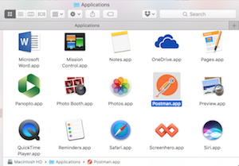
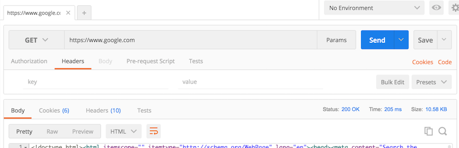
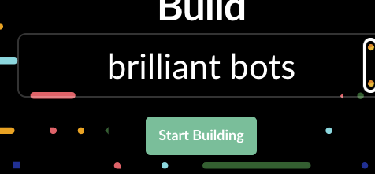
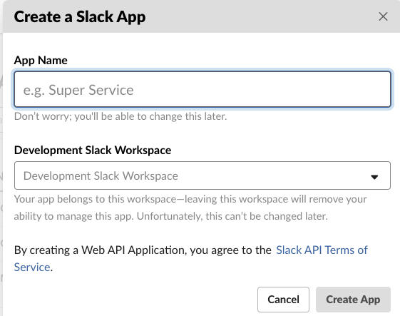
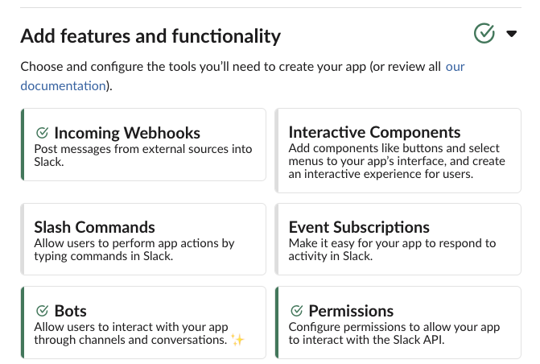
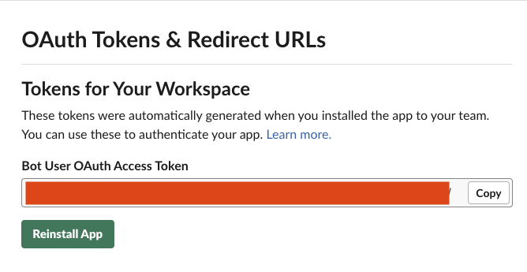
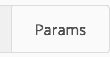
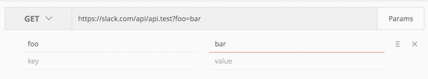
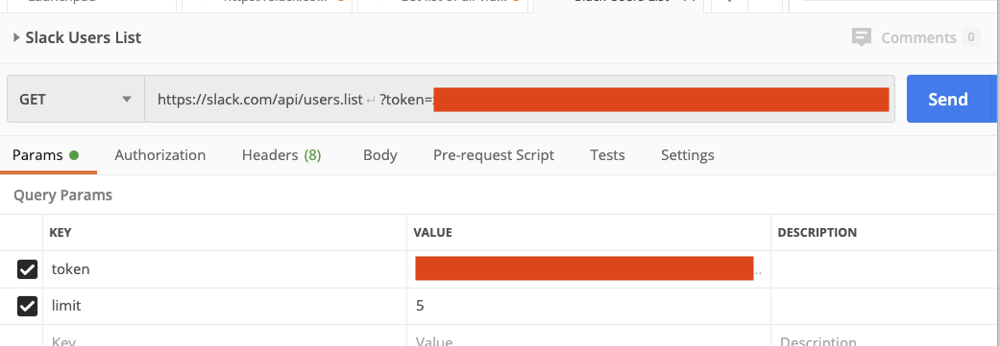

# API Tools

<iframe src="https://adaacademy.hosted.panopto.com/Panopto/Pages/Embed.aspx?pid=43d92954-e023-4964-bbcb-ac4400423e0b&autoplay=false&offerviewer=true&showtitle=true&showbrand=false&start=0&interactivity=all" height="405" width="720" style="border: 1px solid #464646;" allowfullscreen allow="autoplay"></iframe>

## Learning Goals

By the end of this lesson we will be able to...

- Identify the need for tools to assist with making API requests
- Play with `curl`
- Play with Postman

### Tools Intro

Making API requests from your browser directly (typing in a URL) has it's limitations. Oftentimes, API requests require you to pass in additional data (params) or use HTTP Verbs other than `get` (which is all your browser can give you). There are many different ways to interact with APIs that give you much more control.

### curl

`curl` is a command you can run in your terminal that will allow to you make HTTP requests. Note that `curl` is extremely powerful and does a lot more than what we'll show, but will act as a starting point for us right now.

In the most basic way, `curl` allows you to retrieve output from HTTP requests.

The response from Google:
```bash
$ curl http://www.google.com
```

A much more complex example, passing params in on a post request:
```bash
$ curl -H "Accept: application/json" -H "Content-type: application/json" -X POST -d '{"id":100}' http://localhost:3000/api/data/
```


### Postman

[Postman](https://www.getpostman.com/) is a browser plug-in or standalone app that you can utilize to send API requests. This is much better than `curl` (in someone's opinion) because it provides a user interface to interact with your requests as well as responses. Postman also keeps a history of requests for you so you can track your progress.

#### Using The Native Mac Postman App

To use the Postman Native App you can download it from [getpostman.com](https://www.getpostman.com) and download the App.  You can paste it into your Applications folder to install it.  [It has a few advantages over the Chrome extension](https://www.getpostman.com/docs/why_native).



The Postman App has two main sections.  The left **Sidebar** keeps track of previously created requests.  The main section is called the **Request Editor** and in that section you can put together an API request, run it and view the results.  


##### Getting a Normal Webpage

In the URL Bar place:  https://www.google.com/ and click **Send**.  



Take a look at the Body, Cookies & Headers returned.  Postman sends http requests just like a browser, but it lets you examine the content more easily and tailor your requests to examine the response.  Notice the cookies returned, which Google uses to track your session across their site.  

In the Header section you can see the Content-Type `Content-Type →text/html; charset=ISO-8859-1` which tells the client which type of information is being returned.  

#### Reading from a JSON API

You can also use the iTunes API to search for content on Apple's platform.  

In the URL bar enter:  `https://itunes.apple.com/search?term=` followed by anything you want to search by.  If your term has spaces or other characters not allowed in a URL, you can highlight the term and right click to make it URL friendly.  Select `Encode URI Component`  


So `https://itunes.apple.com/search?term=Red Hot Chili Peppers` becomes `https://itunes.apple.com/search?term=Red%20Hot%20Chili%20Peppers`

Examine the results.  Can you find links to album covers?  What about music samples?

### Slack API With Postman

Slack, the chat program we all know and love has a robust [API](https://api.slack.com) that the Slack App uses to function.  It's a great way to learn how APIs work and experiment with Postman.

Click on **Start Building**



To interact with Slack you need to create a **Slack App**.



#### Add Permissions to Your App

By default your application has no permissions to do ANYTHING in slack.  This is a common security model, where apps only get the minimal permissions they need.  You can go to **Add features and functionality** and then click on **Permissions**.



You will then see your OAuth token.  This token is kinda like your password and should **never** be shared with anyone.  Copy this token to a text file on your computer for the moment, you'll need it later.



Then you can go to **Scopes** to add permissions to your app with the **Add an OAuth Scope**.  For now lets add:

- **channels:read**
- **groups:great**
- **im:read**
- **incoming-webhook**
- **mpim:read**
- **users:read**

[Scopes](images/scopes.png)

#### Starting with Testing!

To start in the URL bar we can run the Slack Test method to learn how to call the API and how to use parameters.  The Slack test method essentially parrots what we send it back to us in JSON form.  

Go to the address bar and enter:  [https://slack.com/api/api.test?foo=bar](https://slack.com/api/api.test?foo=bar)

Then hit submit you should get the following response:

```json
{
  "ok": true
}
```

Next click on the Params button

  

Add the following key and value.  `foo: bar`



Then hit **send**.  What do you get?

```json
{
  "ok": true,
  "args": {
    "foo": "bar"
  }
}
```

Notice what happens to the URL line:  `https://slack.com/api/api.test?foo=bar`  The parameters go into the url line.   These are called **get parameters**. For most other requests we will need to add another parameter called `token` and give it the value of our oAuth token.   

#### Listing Slack Users

Take a look at the Slack API Documentation for the [users.list](https://api.slack.com/methods/users.list) method.  This method, unlike test, requires the authentication token.  

Enter `https://slack.com/api/users.list` in the URL bar and the authentication token as a parameter.  Then hit submit.  



Look at the results:

-  What do you get?
-  What happens when you leave off the token?


You should have a JSON object returned as a response with the details of the users or a response indicating failure.  

#### Experimenting on your own:

With your neighbor(s) take a look at the [Slack API](https://api.slack.com/methods) and try to use some of the other methods.  Try other parameters the API Docs show you.

## Resources

- [TutorialsPoint curl docs](https://www.tutorialspoint.com/unix_commands/curl.htm)  
- [Sending Requests with Postman](https://www.getpostman.com/docs/requests)
- [Github API](https://docs.github.com/en/free-pro-team@latest/rest/reference)