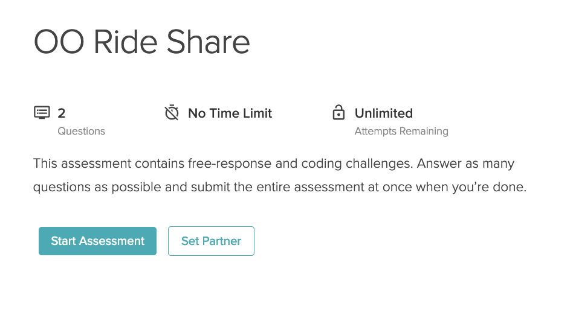

# Slack CLI

### !challenge

* type: testable-project
* id: 6a85048b-699d-4973-abba-21f2fa26900d
* title: Slack CLI
* upstream: https://github.com/ada-c14/slack-cli
* validate_fork: true
* points: 0
* topics: apis

##### !question

1.  One partner fork the [Slack CLI](https://github.com/ada-c14/slack-cli) Repository
1.  The same person then adds their partner as a collaborator.
1.  Then you can clone the repository and work on the project.
1.  When you submit, one person can add a partner when submitting.

Example image of setting a partner for a project:

Remember to submit **both** a pull request and the repository through Learn.  Each team should only need to submit once. 

##### !end-question

##### !placeholder

Link to your Project Repo

##### !end-placeholder

### !end-challenge

### !challenge

* type: short-answer
* id: d361c7e1-2b65-40bc-b7fe-42bd9dcc3199
* title: Pull Request Link
* points: 2
* topics: apis

##### !question

In this field place a link to your Pull request

##### !end-question

##### !placeholder

Place a link to your pull request for the Slack CLI project

##### !end-placeholder

##### !answer

/.*/

##### !end-answer

### !end-challenge
